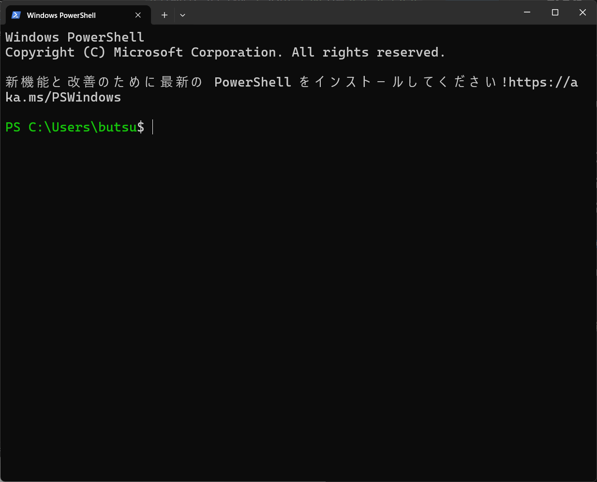

# PowerShell の文字の色を変更する.




## 手順
PowerShellのカレントディレクトリに色がついていたら便利である. 色を付ける手順について詳述する.
次のフォルダに添付のps1ファイルを入れる.
```
"$HOME\Documents\WindowsPowerShell"
```

もし, PowerShell Coreを使っている場合は次のフォルダである.
```bash
"$HOME\Documents\PowerShell"
```

以上

## 補足
ps1ファイルの中身を次に示す.
```bash
function prompt {
    $currentPath = $(Get-Location)
    Write-Host ("PS ") -ForegroundColor Green -NoNewline
    Write-Host ($currentPath) -ForegroundColor Green -NoNewline
    return "$ "
}
```
これは色を付けるスクリプトである. このps1ファイルはpowershellが起動するたびに実行される. 
もし, powershellであらかじめ実行したいことがある場合はこのファイルに追記するとよい.